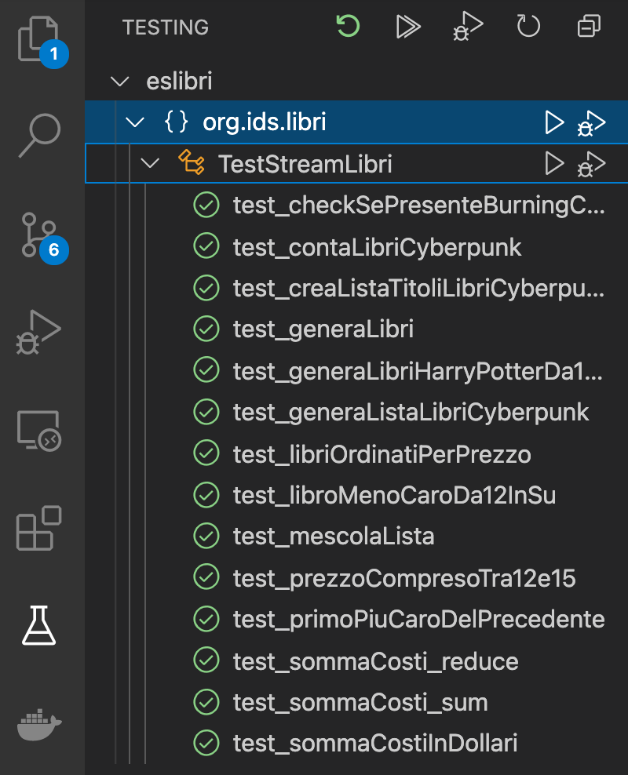

# Java 8 Streams: Esercizi su Stream di Libri

I test sono scritti con *JUnit*, completi di asserzioni scritte con *AssertJ*, una libreria molto usata per scrivere asserzioni complesse con uno stile fluent.

Il progetto *Maven* contiene:

- *Libro*: una semplice classe usata per gli esercizi sugli stream: ogni libro è caratterizzato da un titolo, un costo e una categoria;

- *Libreria*: una classe composta da metodi statici usata per generare dei libri di vario genere. La generazione avviene in maniera deterministica (non viene usato random()) in modo da permettere di scrivere test con esito prevedibile.

- *TestStreamLibri*: file di test in cui viene verificata la correttezza della soluzione agli esercizi;

- *StreamLibri*: file con i metodi da implementare per lo svolgimento degli esercizi.

## Esecuzione dei test
Si può usare maven (`mvn test`) o più semplicemente si può usare il supporto all'esecuzione dei test fornito dall'IDE. Ad esempio, in VS Code, nella barra laterale di sinistra è possibile richiamare la colonna "Test" in cui è possibile eseguire tutti i test. I test possono anche essere eseguiti singolarmente.

## Sviluppo collaborativo
Dividendosi in gruppi di due o tre sviluppatori, fare un **fork** di questo repository e risolvere gli esercizi assieme, lavorando contemporaneamente sul repository creato con il fork.

Il fork consisten nel creare una copia del repository nel proprio namespace. In questo modo è possibile avere accesso completo alla propria copia, permettendo di fare il push di commit e di fornire l'accesso ad altri utenti su git (i colleghi con cui svolgere gli esercizi).

Ogni sviluppatore deve creare un feature branch per svolgere gli esercizi, facendo poi il merge con il brance principale (master o main).
